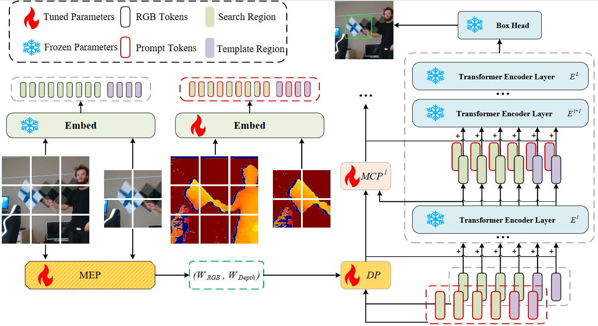
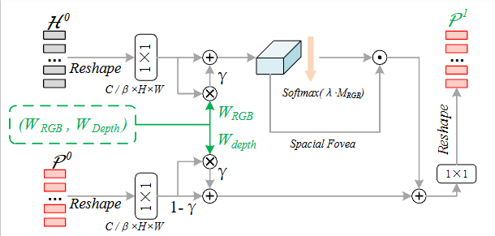

# DPTracker

DPTracker: DYNAMIC PROMPTER FOR RGB-D Tracking


## Architecture & Module Details
### Overall Architecture
<div align="center">
  
</div>

### Core Modules
#### Dynamic Prompter (DP)
<div align="center">
  
</div>

#### Modality Effectiveness Predictor (MEP)
<div align="center">
  
</div>


## Trained Checkpoints
We provide trained checkpoints
(https://drive.google.com/open?id=1HjNX06R-1JtUzgW3ZJ9QbDqgJunzk4Nc&usp=drive_fs)


## Usage
### Installation
Create and activate a conda environment:
```
conda create -n dptracker python=3.7
conda activate dptracker
```
Install the required packages:
```
bash install_dptracker.sh
```

### Data Preparation
Put the training datasets in ./data/. It should look like:
```
$<PATH_of_ViPT>
-- data
    -- DepthTrackTraining
        |-- adapter02_indoor
        |-- bag03_indoor
        |-- bag04_indoor
        ...
```

### Training
Dowmload the pretrained [foundation model](https://drive.google.com/drive/folders/1ttafo0O5S9DXK2PX0YqPvPrQ-HWJjhSy?usp=sharing) (OSTrack) 
and put it under ./pretrained/.
```
bash train_dptracker.sh
```

### Testing
#### For RGB-D benchmarks
[DepthTrack Test set & VOT22_RGBD]\
These two benchmarks are evaluated using [VOT-toolkit](https://github.com/votchallenge/toolkit). \
You need to put the DepthTrack test set to```./Depthtrack_workspace/``` and name it 'sequences'.\
You need to download the corresponding test sequences at```./vot22_RGBD_workspace/```.

```
bash eval_rgbd.sh
```

## Acknowledgment
This repo is based on [ViPT](https://github.com/jiawen-zhu/ViPT) which is an excellent work.
 
